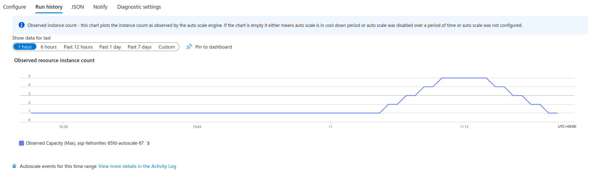

# Photo as a Service

### Választott környezet

Az alkalmazás Azure-on fut, külön App Service resourceokkal:

- frontend: Next.js alkalmazás
- backend: ASP.NET Core Web API
- adatbázis: Azure Database for PostgreSQL Flexible Servers

A deployment GitHub Actions workflow-kon keresztül történik. Az App Service-ek (frontend, backend) létrehozásakor kapott template-eket módosítottam úgy, hogy csak az adott folderre vonatkozó változtatásokkor fussanak le.

### Rétegek

1. Prezentációs réteg

- Next.js kliens.
- A felhasználó innen éri el a be/kijelentkezést, regisztráció, lista nézetet, feltöltést és törlést.

1. Alkalmazási réteg

- ASP.NET Core API végpontok.
- Itt történik az autentikáció (.NET Identity) és a képek CRUD műveletei.

1. Adatréteg (PostgreSQL)

- Identity táblák és Photos tábla.
- EF Core migrációk kezelik a séma létrehozását/frissítését.
- A feltöltött képek Azure Blob Storageben vannak tárolva.

### Kapcsolatok a rétegek között

- A frontend HTTP hívásokkal éri el a backend API-t.
- A backend EF Core segítségével kapcsolódik a PostgreSQL adatbázishoz.
- A frontend és backend kapcsolatához Azureban megadott környezeti változók adják az engedélyezett origint a backendnek, és a backend címét a frontendnek. Illetve a DB connection stringjét is a backend számára.

### Automatikus skálázódás

Az automatikus skálázódást a backend App Service Scale Out beállításával érem el. Itt az automatikus skálázást szabályokhoz lehet kötni. Én ezt a két szabály adtam meg:

- Ha a CPU kihasználtság 2 percig legalább átlagosan 80%, induljon egy új instance.
- Ha a CPU kihasználtság 2 percig legfeljebb átlagosan 30%, álljon le egy instance.

A Scale Out helyes működését egy Azure Load Testing erőforrással futtatott locust scripttel ellenőriztem. A loadtest/locustfile.py script két féle felhasználót szimulál:

- Egy be nem jelentkezett felhasználó aki csak lekéri a képeket és megnéz párat (legalább 5-öt).
- Egy felhasználó aki a teljes "életciklust" végigcsinálja. Azaz:

 1. Regisztrál egy felhasználót
 2. Belép a regisztrált felhasználóval
 3. Feltölt (random macskás) képeket, lekéri a képeket, és megnéz képeket.
 4. Kitörli a feltöltött képeit.
 5. Kitörli a felhasználót.

A load testet több konfigurációban is futtattam, 40-100 felhasználó között, 10-30 perces tesztekkel. A maximum instance limitet 10-re állítottam (ennyi elérhető azerőforrásnál), de általában nem volt mindre szükség. A load test futtatása során, a backend megfelően skálázódik fel, majd a teszt végeztével le, mint ahogy a képen látható.

